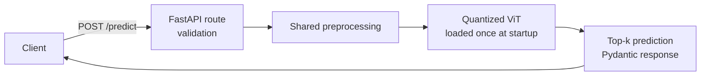
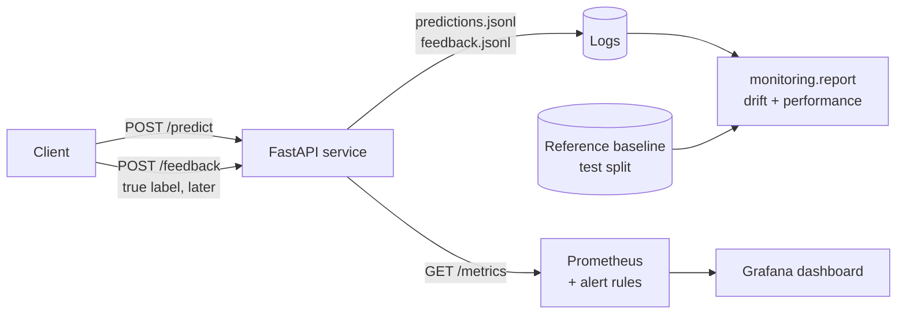
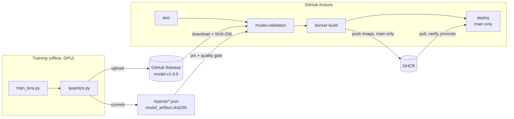
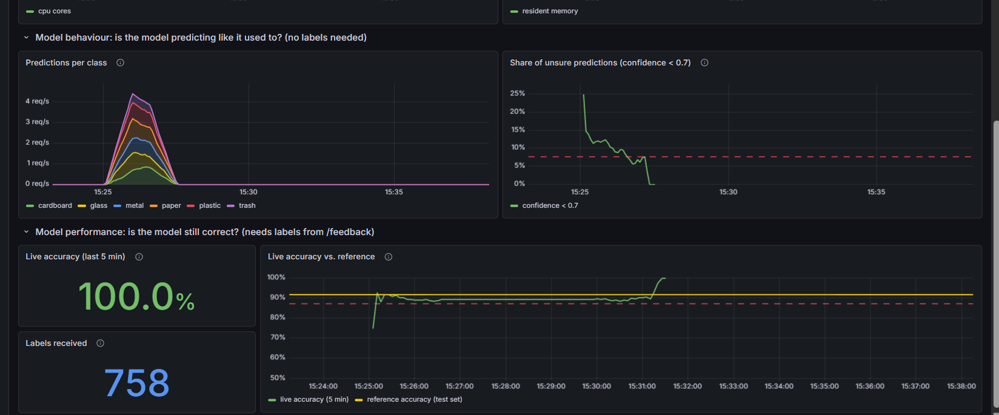
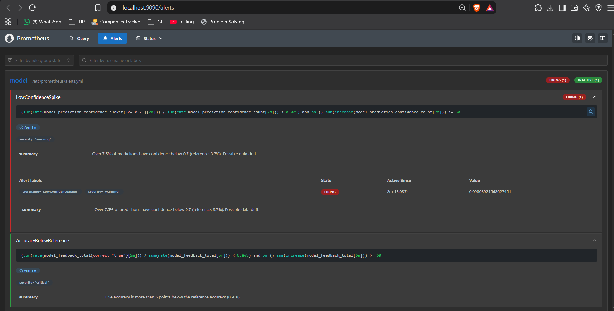

# ViT LoRA Inference Service

An end-to-end Vision Transformer image classification service featuring parameter-efficient LoRA fine-tuning, model quantization, FastAPI inference, Docker containerization, automated testing, an MLOps CI/CD pipeline that validates, packages and deploys the model on every change, and ML observability: data drift, prediction drift, live accuracy, service metrics, a Grafana dashboard and alerts.

## Overview

Recycling plants lose money when materials are mis-sorted. This project classifies a photo of a single waste item into one of six material classes — **cardboard, glass, metal, paper, plastic, trash** — and serves the model as a production-style HTTP API.

The pipeline covers the full lifecycle: fine-tune a pretrained ViT with LoRA, keep the best checkpoint, merge and INT8-quantize it for CPU serving, expose it through FastAPI, and ship it as a Docker image.

## Key Features

- Vision Transformer (ViT-Base/16) image classification
- LoRA parameter-efficient fine-tuning (PEFT)
- Best-model checkpointing by validation macro-F1
- INT8 quantization with before/after size, latency and accuracy measurement
- FastAPI service with input validation, typed responses and OpenAPI docs
- CPU-only Docker image with health check and non-root user
- Automated tests (unit + API + real-model smoke test)
- MLOps CI/CD with GitHub Actions: tests → model validation → Docker build → deployment verification
- Versioned model artifact (GitHub Release) pinned by SHA-256, with an automated model quality gate
- ML observability: structured prediction logs, ground-truth feedback endpoint, Prometheus metrics, drift and performance reports against a reference baseline
- Monitoring stack with Docker Compose: Prometheus, Grafana dashboard and alert rules

## Architecture

**Training pipeline (offline, GPU):**

```mermaid
flowchart LR
    A[TrashNet images] --> B[Stratified split<br/>train / val / test]
    B --> C[Shared preprocessing]
    C --> D[Pretrained ViT<br/>frozen]
    D --> E[+ LoRA adapters<br/>q_proj, v_proj]
    E --> F[Fine-tuning<br/>FP16 mixed precision]
    F --> G[Best LoRA adapter<br/>by val macro-F1]
    G --> H[Merge into base weights]
    H --> I[INT8 quantization]
    I --> J[models/quantized]
```



**Serving pipeline (Docker, CPU):**



**Monitoring (Docker Compose):**



The same `src/preprocessing.py` is used in training and serving, so the model sees images prepared identically in both (no training/serving skew).

## Technologies

| Technology | Purpose |
|---|---|
| PyTorch | Training loop, mixed precision, inference |
| Hugging Face Transformers | Pretrained ViT and image processor |
| PEFT | LoRA adapters, merging |
| torchao | INT8 quantization (PyTorch's official quantization library) |
| FastAPI + Uvicorn | HTTP inference API with OpenAPI docs |
| Pydantic / pydantic-settings | Response schemas and typed, env-driven configuration |
| Docker | Reproducible CPU serving image |
| pytest | Automated tests |
| GitHub Actions | CI/CD pipeline (`.github/workflows/ci-cd.yml`) |
| GitHub Releases | Versioned storage for the serving model artifact |
| GitHub Container Registry (GHCR) | Registry for the deployed Docker image |
| Prometheus (+ prometheus-client) | Metrics collection, history and alert rules |
| Grafana | Monitoring dashboard |
| Docker Compose | Runs the API, Prometheus and Grafana together |

## Project Structure

```
src/                      Serving code + components shared with training
  config.py               Typed settings from env vars / .env (no hardcoded paths)
  preprocessing.py        Image decoding/validation and ViT preprocessing (shared)
  model.py                Model construction, INT8 quantization, save/load
  inference.py            InferenceService: model loaded once, top-k predictions
  schemas.py              Pydantic API request/response models
  api.py                  FastAPI app: /health, /predict, /feedback, /metrics
  metrics.py              Prometheus metrics (requests, latency, predictions, confidence, feedback)
  prediction_log.py       Structured JSON Lines logs of predictions and feedback
  image_stats.py          Image statistics used for data drift (shared with the reference builder)
monitoring/               Offline monitoring tools (not in the Docker image)
  build_reference.py      Reference baseline: model behaviour on the held-out test split
  drift.py                PSI and KS drift statistics, thresholds
  report.py               Drift + performance report vs the reference (Markdown + JSON)
  simulate_traffic.py     Demo traffic: normal or darkened images, plus feedback labels
observability/            Prometheus config + alert rules, Grafana datasource + dashboard
docker-compose.yml        API + Prometheus + Grafana
training/                 Offline pipeline — never shipped in the Docker image
  data.py                 TrashNet download, stratified split, Dataset
  evaluation.py           Accuracy, macro-F1, per-class F1, confusion matrix
  train_lora.py           LoRA fine-tuning with best-checkpoint selection
  quantize.py             Merge LoRA -> INT8 -> measure -> save -> verify reload
tests/                    pytest suite
  assets/sample.jpg       Real photo used by the deployment smoke test
reports/                  JSON results from training and quantization, monitoring reference and example reports
docs/images/              Dashboard and alert screenshots
models/                   Generated model artifacts (git-ignored; published as a GitHub Release)
scripts/
  check_model_metrics.py  Model quality gate used by CI
  smoke_test.sh           HTTP smoke test of a running container: health, predict, feedback, metrics
.github/workflows/
  ci-cd.yml               GitHub Actions pipeline: test -> model-validation -> docker-build -> deploy
model_artifact.sha256     SHA-256 pin of the released model files
Dockerfile, .dockerignore Serving image
requirements*.txt         serving / training / test dependencies
```

## Model

| | |
|---|---|
| Architecture | ViT-Base, patch size 16, 224×224 input (~86M parameters) |
| Pretrained checkpoint | [`google/vit-base-patch16-224-in21k`](https://huggingface.co/google/vit-base-patch16-224-in21k) (ImageNet-21k) |
| Dataset | [TrashNet](https://huggingface.co/datasets/garythung/trashnet) (resized version) |
| Classes | 6 — cardboard, glass, metal, paper, plastic, trash |
| Split | Stratified 70 / 15 / 15 train / validation / test, seed 42 |
| Preprocessing | EXIF rotation fix → RGB → resize 224×224 → normalize (mean/std 0.5) |
| Augmentation | Random horizontal flip (training only) |
| Training | AdamW, lr 2e-3, weight decay 0.01, linear warmup (10%) + decay, batch 32, 5 epochs, FP16 mixed precision |

**How ViT works:** the image is cut into a 14×14 grid of 16×16-pixel patches. Each patch is flattened into a vector and treated like a word in a sentence. A transformer lets every patch attend to every other patch, and a special `[CLS]` token aggregates a summary of the whole image that the classification head reads.

**Why TrashNet:** small enough for fast fine-tuning, but a real, easily explained problem with genuinely confusable classes (clear plastic vs glass, paper vs cardboard) and a class imbalance ("trash" is the smallest class) that makes evaluation choices matter. It has no official split, so a seeded stratified split is created and reused identically by training and quantization.

## LoRA

**What it is:** instead of updating a large weight matrix *W*, LoRA freezes *W* and learns a low-rank correction *ΔW = B·A*, where *A* and *B* are thin matrices of rank *r* (here 16). The effective weight is *W + (α/r)·B·A*.

**Why:** far fewer trainable parameters → less GPU memory (no gradients or optimizer state for frozen weights), faster training, less overfitting on a small dataset, and a checkpoint of a few MB instead of hundreds.

**Where it is applied:**
- LoRA adapters on the attention **query and value projections** (`q_proj`, `v_proj`) in every transformer layer.
- The new **classification head** has no pretrained weights, so it is trained fully (`modules_to_save`).
- Everything else is frozen.

| | Parameters |
|---|---|
| Trainable | 594,438 |
| Total | 86,397,708 |
| Trainable share | **0.69%** |
| Saved adapter size | 2.38 MB (vs 343 MB for the full FP32 model) |

**Merging:** after training the adapter is folded into the base weights (`merge_and_unload`). The result is an ordinary ViT with zero adapter overhead at inference, which also means the serving image does not need `peft`.

## Quantization

**What it is:** storing weights as 8-bit integers plus a scale factor instead of 32-bit floats — like measuring with a coarser ruler. Roughly 4× smaller for the quantized layers, with a small accuracy risk that is measured, not assumed.

**Method:** INT8 weights for every `nn.Linear` layer, executed with `torchao`. One model file serves two runtime modes, chosen by `APP_QUANTIZATION_MODE`:

| Mode | What runs in INT8 | When to use |
|---|---|---|
| `weight_only` (default) | Weights stored as INT8 in memory; converted to float per layer for the matmul | Any CPU. Delivers the memory reduction everywhere, speed ≈ FP32 |
| `dynamic` | INT8 weights × INT8-quantized activations | Only CPUs with fast integer matmul instructions (e.g. Intel VNNI/AMX servers), where it is faster than FP32 |

**Why these choices:**
- ViT is almost entirely Linear layers (attention projections and MLPs), so quantizing Linear layers captures most of the benefit.
- No calibration dataset is needed for either mode.
- It runs on **CPU**, so the serving image needs no GPU.
- `torchao` is PyTorch's supported quantization library; the older `torch.ao.quantization` API is deprecated.

**Why `weight_only` is the default — measured, not assumed.** The first implementation used `dynamic`. On the development laptop it was correct but far slower than FP32:

| Measurement (dynamic mode, ViT-Base, this project's model) | FP32 | INT8 dynamic |
|---|---|---|
| Single image, native Windows, 6 CPU threads | 132 ms | 11,329 ms |
| Full evaluation run in WSL2 (Linux) on the same laptop | — | 0.06× FP32 speed |

Because it was slow on both Windows and Linux on the same machine, the cause is the CPU rather than the OS: the laptop's Intel Core i7-10750H has no VNNI or AMX instructions (confirmed from its CPU feature flags), which fast INT8 matmul relies on; on a server CPU in a pre-selection benchmark, `dynamic` was about 2× faster than FP32. Speedups from quantization depend on the hardware, so the portable mode is the default and `dynamic` is opt-in.

**Storage:** each Linear weight is saved as INT8 with one FP32 scale per output row (symmetric per-channel), in safetensors. Biases, LayerNorms and embeddings stay FP32 (they are a small share of the parameters). At load time the weights are restored and torchao quantizes the model in memory.

**Accuracy/performance considerations:** measured on CPU on the held-out test set for the FP32 merged model and for the INT8 model *as reloaded from disk* — exactly what the API serves.

## Results

All numbers come from `reports/training_summary.json` and `reports/quantization_report.json`, produced by the commands in this README. Nothing here is estimated.

**Fine-tuning** (NVIDIA RTX 2070 Max-Q, FP16 mixed precision, ~117 s per epoch on native Windows; an earlier run of the same code took ~16 s per epoch, and the difference was not investigated)

| Epoch | Train loss | Val loss | Val accuracy | Val macro-F1 |
|---|---|---|---|---|
| 1 | 0.9701 | 0.2709 | 0.9156 | 0.8754 |
| 2 | 0.1928 | 0.2360 | 0.9235 | 0.9078 |
| 3 | 0.0662 | 0.1693 | 0.9472 | 0.9321 |
| 4 | 0.0272 | 0.1600 | 0.9499 | 0.9417 |
| 5 | 0.0150 | 0.1490 | 0.9578 | **0.9493** ← best |

**Held-out test set** (379 images, never used for any decision)

| Metric | Value |
|---|---|
| Accuracy | **0.9182** |
| Macro-F1 | **0.8839** |

| Class | cardboard | glass | metal | paper | plastic | trash |
|---|---|---|---|---|---|---|
| Test images | 60 | 75 | 62 | 89 | 72 | 21 |
| F1 | 0.959 | 0.948 | 0.943 | 0.930 | 0.904 | **0.619** |

**Reading these results:**
- Validation macro-F1 (0.95) is higher than test macro-F1 (0.88) because the checkpoint was *selected* on validation, which makes it optimistic; the test number is the honest estimate. With 379 test images each error moves accuracy by ~0.26 points.
- The weak class is **trash** (13 of 21 correct). It is the smallest class and the most visually varied (it is "everything else"); most of its errors are confusion with plastic and paper, and some paper/cardboard/metal items are predicted as trash. This is why macro-F1 (0.88) sits below accuracy (0.92), and why checkpoints are selected by macro-F1.
- Validation macro-F1 was still improving at epoch 5; more epochs, selected on validation only, are a reasonable next experiment.

**Quantization** (CPU: Intel Core i7-10750H, native Windows, 6 threads; `weight_only` mode; same run, same test set)

| | FP32 (merged) | INT8 (as served) | Change |
|---|---|---|---|
| Weights size | 343.23 MB | **88.76 MB** | **3.87× smaller** |
| Latency, median (1 image) | 210.9 ms | 257.4 ms | 0.82× (≈18% slower) |
| Latency, p95 | 227.5 ms | 278.4 ms | |
| Test accuracy | 0.9182 | 0.9182 | 0.0 |
| Test macro-F1 | 0.8839 | 0.8839 | 0.0 |
| Test loss | 0.2563 | 0.2573 | +0.0010 |

The confusion matrix is identical before and after quantization. The small latency cost comes from converting INT8 weights back to float for each matmul — the price of `weight_only` mode running on a CPU without fast INT8 instructions (see [Quantization](#quantization)). The raw reports are in `reports/`, including `quantization_report_dynamic.json` from the earlier `dynamic`-mode run.

## API

Interactive docs (Swagger UI): `http://localhost:8000/docs`

### GET /health

```json
{"status": "ok", "model_loaded": true, "model_version": "model-v1.0.0", "classes": ["cardboard", "glass", "metal", "paper", "plastic", "trash"]}
```

### POST /predict

Multipart upload with one image field named `file`.

```bash
curl -X POST http://localhost:8000/predict -F "file=@bottle.jpg"
```

PowerShell:
```powershell
curl.exe -X POST http://localhost:8000/predict -F "file=@bottle.jpg"
```

Real response from the Dockerized service, for a photo of cardboard pieces that is not part of TrashNet:

Every response also contains a `request_id` (used by `/feedback`), omitted below for brevity.

```json
{
  "label": "cardboard",
  "confidence": 0.9946,
  "top_k": [
    {"label": "cardboard", "confidence": 0.9946},
    {"label": "trash", "confidence": 0.0021},
    {"label": "paper", "confidence": 0.0021}
  ],
  "inference_ms": 177.57
}
```

| Status | When |
|---|---|
| 200 | Prediction returned |
| 400 | File is not a decodable image |
| 413 | File larger than `APP_MAX_IMAGE_BYTES` (default 5 MB) |
| 415 | Content type is not `image/*` |
| 422 | No `file` field in the request |

### POST /feedback

Attaches the true label to an earlier prediction, for example after a person checked it. Ground truth usually arrives later than the prediction, so it is a separate call.

```bash
curl -X POST http://localhost:8000/feedback -H "Content-Type: application/json" \
  -d '{"request_id": "3f2b9c0e8d4a4f6b9e1c2d3a4b5c6d7e", "true_label": "glass"}'
```

```json
{"request_id": "3f2b9c0e8d4a4f6b9e1c2d3a4b5c6d7e", "predicted_label": "glass", "true_label": "glass", "correct": true}
```

Returns `404` for an unknown `request_id` and `422` for an unknown class.

### GET /metrics

Current metric values in Prometheus text format, scraped by Prometheus (see [Monitoring and Observability](#monitoring-and-observability)).

## Running Locally

```bash
python -m venv .venv
# Windows: .venv\Scripts\activate    Linux/macOS: source .venv/bin/activate

# GPU training: install the CUDA build of torch FIRST (see pytorch.org), e.g.
pip install torch==2.14.0 --index-url https://download.pytorch.org/whl/cu130

pip install -r requirements-train.txt -r requirements-dev.txt
cp .env.example .env            # Windows: copy .env.example .env

python -m training.train_lora   # downloads ViT + TrashNet, trains, saves models/lora_best
python -m training.quantize     # merges, quantizes, saves models/quantized + reports
uvicorn src.api:app --port 8000
```

Useful training options: `--epochs`, `--batch-size`, `--lr`, `--lora-r`, `--num-workers`, `--no-amp` (`python -m training.train_lora --help`).

## Running with Docker

The image contains only the serving code and `models/quantized/`. Either run training and quantization first, or download the released model and verify it (this is exactly what CI does):

```bash
gh release download model-v1.0.0 --dir models/quantized   # or download the 3 files from the Releases page
sha256sum --check model_artifact.sha256                   # PowerShell: Get-FileHash models\quantized\* -Algorithm SHA256
```

A verified image is also published by the pipeline: `docker pull ghcr.io/nadiinahmed/vit-lora-inference-service:latest` (authenticate with `docker login ghcr.io` if the package is private).

The resulting image is **462 MB compressed** (what a registry pull downloads) and 1.97 GB unpacked on disk, as reported by Docker Desktop; most of it is the CPU-only PyTorch runtime, and the model accounts for 89 MB. Using the CPU build of PyTorch instead of the default CUDA build keeps the image several times smaller.

```bash
docker build -t vit-lora-inference-service .
docker run -p 8000:8000 vit-lora-inference-service

# On a server CPU with fast INT8 matmul support:
docker run -p 8000:8000 -e APP_QUANTIZATION_MODE=dynamic vit-lora-inference-service
```

Then open `http://localhost:8000/docs`, or call `/health` and `/predict` as shown above. On the development laptop the model loads in about 1.4 s at startup, and `docker ps` reports the container as `healthy` once Docker's built-in health check gets a `200` from `/health` (it re-checks every 30 s).

## Testing

```bash
pytest
```

| File | What it covers |
|---|---|
| `tests/test_inference.py` | Image decoding for all colour modes, rejection of corrupt input, preprocessing shape, deterministic quantized save/load, top-k ordering and capping |
| `tests/test_api.py` | `/health`, `/predict` and its 400 / 413 / 415 / 422 error paths, prediction logging, `/metrics`, `/feedback` |
| `tests/test_image_stats.py`, `tests/test_drift.py` | Image statistics and the PSI / KS drift calculations on known cases |
| `tests/test_build_reference.py`, `tests/test_report.py`, `tests/test_simulate_traffic.py` | Reference baseline, drift/performance report statuses, traffic simulator |
| `tests/test_data.py` | Stratified split proportions, no train/test leakage, determinism, dataset folder discovery, metric correctness on a known case |
| `tests/test_real_model.py` | Loads the real quantized model and predicts (skipped until it exists) |

In CI the real-model test is not skipped: the pipeline downloads the released model first (see [MLOps Pipeline](#mlops-pipeline)).

The unit and API tests use a tiny randomly initialised ViT with the real architecture, so they run in about a second, offline, and exercise the same quantize → save → load → predict code path as production.

## MLOps Pipeline

The project separates the ML lifecycle into stages with different triggers:

| Stage | Where it runs | When | Output |
|---|---|---|---|
| Training + quantization | Offline, GPU workstation (`training/`) | Deliberately, when data or hyperparameters change | Model files + `reports/*.json` |
| Model release | GitHub Release `model-vX.Y.Z` | Manually, after reviewing the reports | Versioned, downloadable model |
| CI | GitHub Actions | Every pull request and every push to `develop` / `main` | Validated code, model and container |
| CD | GitHub Actions | Push to `main` only | Image in GHCR, deployed, verified and promoted |

**Training is intentionally not part of CI.** It is slow, needs a GPU, and most commits (API, tests, docs) do not change the model. CI/CD consumes the released model instead, so a code change is always tested against the exact model that will ship.



### Code and model artifacts

| Artifact | Stored in | Versioned by |
|---|---|---|
| Source code, tests, workflow | Git | Commits |
| Evaluation reports | Git (`reports/`) | Commits, together with the model pin |
| Serving model (89 MB) | GitHub Release `model-v1.0.0` | Release tag + SHA-256 in `model_artifact.sha256` |
| Docker image | GitHub Container Registry | Commit SHA tag, plus `latest` after verification |

The model is too large for Git, so the repository **pins** it instead of storing it: `model_artifact.sha256` lists the fingerprint of each model file. CI downloads the release and runs `sha256sum --check`; a missing, corrupted or swapped model fails the pipeline. Shipping a different model therefore requires a reviewed change to this file, just like bumping a pinned dependency.

### Git branching strategy

```
main        production   – every push is deployed
  ↑ pull request
develop     integration  – every push is validated, never deployed
  ↑ pull request
feature/*   work         – validated through its pull request
```

Changes reach `main` only through `develop`, and both merges happen through pull requests whose checks must pass. Typical flow:

```bash
git checkout develop && git pull
git checkout -b feature/my-change
git status && git diff                       # review the work
git add <files> && git commit -m "Describe the change"
git push -u origin feature/my-change         # then open a PR into develop
git merge develop                            # if develop moved on: resolve conflicts, git add, git commit
```

A release is a pull request from `develop` into `main`.

### Workflow jobs

`.github/workflows/ci-cd.yml` chains four jobs with `needs:`, so each runs only if the previous one passed:

| Job | Question it answers | What it does |
|---|---|---|
| `test` | Is the **code** correct? | Runs the pytest suite with a tiny random ViT (fast, offline). |
| `model-validation` | Is the **model** correct? | Downloads release `model-v1.0.0`, verifies SHA-256, runs the quality gate on the reported INT8 test metrics, runs inference with the real model, and hands the verified model to the next job as a workflow artifact. |
| `docker-build` | Is the **service** correct? | Builds the image with the verified model, starts it, and runs `scripts/smoke_test.sh`: `/health`, a real photo through `/predict` (must be classified correctly), rejection of non-images, `/feedback` for that prediction, and the monitoring metrics on `/metrics`. On `main` it publishes the image to GHCR, tagged with the commit SHA. |
| `deploy` | Is the **release** correct? | Pulls the exact image built for this commit, starts it, repeats the smoke test, waits for Docker's HEALTHCHECK to report `healthy`, then promotes the image to `:latest`. |

### Triggers

| Event | test | model-validation | docker-build | deploy |
|---|:-:|:-:|:-:|:-:|
| Pull request into `develop` or `main` | ✅ | ✅ | ✅ (no publish) | – |
| Push to `develop` | ✅ | ✅ | ✅ (no publish) | – |
| Push to `main` | ✅ | ✅ | ✅ + publish | ✅ |
| Push to `feature/*` | – | – | – | – |
| Manual run (`workflow_dispatch`) | ✅ | ✅ | ✅ (no publish) | – |

Feature branches are validated through their pull request rather than on every push.

### Quality gates

A change cannot reach production unless all of these pass:

- **Tests:** unit, API-contract and real-model tests.
- **Model integrity:** every model file matches its SHA-256 in `model_artifact.sha256`.
- **Model quality:** `scripts/check_model_metrics.py` requires INT8 test accuracy ≥ 0.85, macro-F1 ≥ 0.80, and an FP32 → INT8 accuracy drop of at most 1 point. Thresholds live in the workflow's `env:` block.
- **Service behaviour:** the running container loads the model, classifies a real photo (`tests/assets/sample.jpg`) as `cardboard`, and rejects non-image uploads with 415.

### Deployment

- **Registry:** GitHub Container Registry, authenticated with the workflow's automatic `GITHUB_TOKEN`. No credentials are stored in the repository or in secrets.
- **Build once, deploy the same image:** the image tested in `docker-build` is the one pushed, pulled and verified in `deploy`. `:latest` moves only after verification succeeds.
- **Traceability:** the image carries the labels `model.version` and `org.opencontainers.image.revision`, and the `deploy` job uses the `production` environment, so each deployment appears on the repository's Deployments page.
- **Scope:** the deployment target is a fresh GitHub-hosted runner, which stands in for a production host. Deploying to a long-running server (VM, Kubernetes, a managed container service) would reuse the same pull → run → smoke test → promote steps.

### Reproducibility

Everything that affects a result is pinned: Python packages (`requirements*.txt`), the model (`model_artifact.sha256`), the data split (seed 42), the CI runner OS (`ubuntu-24.04`) and the major versions of every GitHub Action.

### Releasing a new model version

1. Retrain and quantize locally, and review `reports/*.json`.
2. Create a GitHub Release, e.g. `model-v1.1.0`, with the three files from `models/quantized/`.
3. On a feature branch, set `MODEL_VERSION` in the workflow and regenerate the pin: `sha256sum models/quantized/* > model_artifact.sha256`.
4. Commit the reports, the pin and the workflow change together, and open a pull request. The pipeline validates the new model before it can reach `main`.

### Running the pipeline checks locally

```bash
pytest -v
gh release download model-v1.0.0 --dir models/quantized
sha256sum --check model_artifact.sha256
python scripts/check_model_metrics.py
pytest tests/test_real_model.py -v
docker build -t vit-lora-inference-service .
docker run -d --name inference -p 8000:8000 vit-lora-inference-service
bash scripts/smoke_test.sh http://localhost:8000 tests/assets/sample.jpg cardboard
```

## Monitoring and Observability

A model can fail silently: the API keeps answering `200 OK` while the inputs change and the predictions get worse. The service is therefore monitored at three levels:

| Level | Question | Signals | Needs labels? |
|---|---|---|---|
| Service | Is the API up, fast and error-free? | uptime, requests/s, error rate, latency p50/p95/p99, CPU, memory | No |
| Data and predictions | Do inputs and predictions look like they used to? | image brightness / contrast / saturation / aspect ratio, class mix, confidence | No |
| Model performance | Is the model still correct? | accuracy and macro-F1 from `/feedback` labels | Yes |

### How it works

1. **Logging.** Every prediction is written to `logs/predictions.jsonl` with a `request_id`, model version, label, confidence, latency and image statistics. The image itself is never stored.
2. **Feedback.** `POST /feedback` attaches a true label to a `request_id` (`logs/feedback.jsonl`).
3. **Reference baseline.** `python -m monitoring.build_reference` records how the model behaves on the 379 held-out **test** images, never seen in training (`reports/monitoring_reference.jsonl`). This defines "normal".
4. **Metrics in real time.** `/metrics` exposes counters and histograms; Prometheus scrapes them every 5 s, Grafana shows them, and alert rules check them.
5. **Drift report on demand.** `python -m monitoring.report` compares the logs with the reference: PSI and KS distance per image statistic, class-mix PSI, confidence drift, and accuracy/macro-F1 on labelled predictions. Statuses are OK / WARNING / ALERT, and NOT ENOUGH DATA below 300 predictions (or 100 labels for performance).

The two paths complement each other: Prometheus is live and cheap but only sees aggregates; the report reads the full logs and can compare whole distributions with the reference.

### Running the monitoring stack

```bash
docker compose up -d --build     # API :8000, Prometheus :9090, Grafana :3000
```

Grafana opens directly on the **ViT Inference Service** dashboard (no login needed to view). The API port can be changed with `API_PORT=8001` if 8000 is busy. Prediction logs are written to `./logs` on the host, so the report can analyse the traffic the container served.

### Demo: normal vs darkened images

`monitoring/simulate_traffic.py` sends the 379 TrashNet validation images to the service and then their true labels to `/feedback`. The `dark` scenario sends the same images at 45% brightness, like a badly lit sorting line.

```bash
python -m monitoring.simulate_traffic --scenario normal
python -m monitoring.report --last 379 --output-dir reports/monitoring/normal

python -m monitoring.simulate_traffic --scenario dark
python -m monitoring.report --last 379 --output-dir reports/monitoring/dark
```

Results (full reports in [`reports/monitoring/normal`](reports/monitoring/normal/report.md) and [`reports/monitoring/dark`](reports/monitoring/dark/report.md)):

| | Reference (test set) | Normal | Dark |
|---|---|---|---|
| Mean brightness | 0.642 | 0.644 (PSI 0.04, OK) | **0.288** (PSI 15.3, ALERT) |
| Contrast | 0.180 | 0.177 (OK) | **0.080** (ALERT) |
| Saturation / aspect ratio | | OK | OK |
| Predictions below 0.7 confidence | 3.7% | 4.8% | **9.2%** (ALERT) |
| Share predicted as "trash" | 5.5% | 5.8% | 9.0% |
| Accuracy | 0.918 | 0.960 | 0.895 |
| **Overall status** | | 🟢 OK | 🔴 ALERT (data + prediction drift), performance OK |

What this shows:

- **The report finds the cause, not only the symptom.** Brightness and contrast drift, while saturation and aspect ratio do not: the lighting changed, not the camera or the objects.
- **Drift is a warning, not a verdict.** Without labels, the drop in confidence is the early signal. With labels, accuracy is still above the alert threshold, so the right reaction is to investigate, not to retrain immediately.
- **A baseline is only as fair as its data.** Both demo runs use the *same* 379 images: darkening costs 6.6 accuracy points (0.960 → 0.895). Measured against the reference (0.918), it looks like only 2.4 points, because the validation images were used to select the best checkpoint, so the model scores unusually well on them. In production, accuracy should also be compared with recent time windows, not only with the original baseline.

### Dashboard and alerts



During the dark run, `LowConfidenceSpike` went from inactive to pending to **firing**, without any labels, while `AccuracyBelowReference` correctly stayed inactive (live accuracy 89.4%, the same value as the offline report):



| Alert | Condition | Severity |
|---|---|---|
| `ServiceDown` | Prometheus cannot reach the API for 1 min | critical |
| `ModelNotLoaded` | API up but model not loaded for 1 min | critical |
| `HighErrorRate` | > 5% of requests return 5xx for 2 min | warning |
| `HighPredictLatency` | `/predict` p95 > 1 s for 5 min | warning |
| `LowConfidenceSpike` | > 7.5% of predictions below 0.7 confidence (about 2× the reference 3.7%), at least 50 predictions, for 1 min | warning |
| `AccuracyBelowReference` | live accuracy < 0.868 (reference − 5 points), at least 50 labels, for 1 min | critical |

The minimum-volume conditions stop the model alerts from firing on the first few requests, where one unsure prediction can make the share jump to 25%.

## Engineering Decisions

- **Train on GPU, serve on CPU.** Training benefits from the GPU; the served model is quantized for cheap CPU inference, which is how most small inference services are deployed.
- **Merge before quantizing.** One plain weight matrix per layer is simpler to quantize and faster to run than base + adapter, and removes `peft` from the serving image.
- **Model selection by macro-F1, not accuracy.** With an imbalanced dataset, accuracy can hide a failing minority class.
- **Single shared preprocessing module**, pinned explicitly to the Pillow-based image processor, so training and serving cannot drift apart.
- **Separate dependency files.** `requirements.txt` (serving, in Docker), `requirements-train.txt` (+ peft), `requirements-dev.txt` (+ pytest). Smaller image, clearer boundaries.
- **Model loaded once at startup (lifespan), fail fast.** If the model cannot load, the server does not start instead of accepting traffic it cannot serve.
- **Synchronous `/predict` handler.** Inference is CPU-bound; FastAPI runs sync handlers in a thread pool so the event loop stays responsive.
- **Portable, code-free model file.** Linear weights are stored as INT8 tensors + per-row scales in **safetensors** (raw tensors, no pickle), and quantized in memory at load time. An earlier `torch.save` version broke on Windows because torchao's pickled tensor objects need `getattr` to rebuild; allowlisting that would have reopened the code-execution risk, so the format was changed instead.
- **No retraining in CI.** Training is a deliberate offline step; CI validates and ships the released model artifact.
- **Model pinned by checksum, not stored in Git.** Keeps the repository small while making every build traceable to exact model bytes.
- **Build once, promote the same image.** Deployment reuses the tested image instead of rebuilding it.
- **Monitoring with plain JSON Lines + Prometheus instead of a monitoring platform.** Image statistics turn images into numbers that drift tests can use; PSI and KS are implemented in a few lines of NumPy with explicit thresholds, so every status in the report can be explained.
- **Reference baseline from the held-out test split**, not the training data: the model is overconfident on images it trained on, which would make all real traffic look like drift.
- **The image statistics code is shared** by the service and the reference builder, so a difference in calculation can never be mistaken for drift.
- **Metric labels use route templates** (`/predict`), never raw URLs, to keep Prometheus label cardinality bounded.
- **Docker layering.** CPU-only torch is installed in its own cached layer; code and model are copied last because they change most often. Runs as a non-root user with `HF_HUB_OFFLINE=1`.

## Limitations

- TrashNet images are studio-style photos of a single item on a plain background; accuracy on cluttered real-world photos will be lower.
- 2,527 images in total; test metrics rest on 379 images (only 21 of them "trash"), so they have noticeable variance.
- The "trash" class is the weakest (test F1 0.619).
- One image per request, no batching; a single Uvicorn worker.
- Quantization speed depends heavily on the CPU: `dynamic` INT8 was ~16× slower than FP32 on the development laptop, hence the `weight_only` default, which reduces memory but does not speed up inference. Reported latencies are for the machine that produced the report.
- No authentication or rate limiting.
- The quality gate checks the metrics recorded when the model was produced; CI does not re-evaluate the model on the test set.
- Deployment is verified on a GitHub-hosted runner, not on a long-running server.
- Alerts are visible in Prometheus and Grafana but not sent anywhere (no Alertmanager, email or Slack).
- Prediction logs are local files on one machine, without rotation; the drift report is run manually, not on a schedule.
- The demo traffic is simulated from TrashNet validation images; real drift would come from new cameras, lighting or waste types.

## Future Improvements

- Request batching and multiple workers for higher throughput
- GPU inference option; ONNX Runtime or `torch.compile` for further CPU speedups
- Benchmark `dynamic` mode on a VNNI/AMX server CPU; static INT8 or lower-bit quantization, evaluated against the same test split
- Training on more varied, real-world waste images
- Alertmanager notifications (email/Slack) and a scheduled drift report job
- Accuracy alerts relative to recent time windows, not only the original baseline
- Automated retraining pipeline triggered by drift alerts and new labelled data (CI/CD with GitHub Actions is now implemented)
- Re-evaluate the model on the held-out test set inside CI instead of trusting the committed report
- Dedicated model registry (e.g. MLflow) and loading the model at startup instead of baking it into the image
- Cloud deployment, Kubernetes, authentication and rate limiting

## Model Artifacts

Trained weights are not committed (see `.gitignore`). The serving model is published as the GitHub Release [`model-v1.0.0`](https://github.com/NadiinAhmed/vit-lora-inference-service/releases/tag/model-v1.0.0) and pinned by `model_artifact.sha256`. To reproduce it instead, run the two training commands above (per-epoch training time is recorded in `reports/training_summary.json`).

## License

This project is licensed under the MIT License — see [LICENSE](LICENSE) for details.
