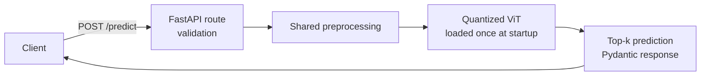

# ViT LoRA Inference Service

An end-to-end Vision Transformer image classification service featuring parameter-efficient LoRA fine-tuning, model quantization, FastAPI inference, Docker containerization, and automated testing.

## Overview

Recycling plants lose money when materials are mis-sorted. This project classifies a photo of a single waste item into one of six material classes — **cardboard, glass, metal, paper, plastic, trash** — and serves the model as a production-style HTTP API.

The pipeline covers the full lifecycle: fine-tune a pretrained ViT with LoRA, keep the best checkpoint, merge and INT8-quantize it for CPU serving, expose it through FastAPI, and ship it as a Docker image.

## Key Features

- Vision Transformer (ViT-Base/16) image classification
- LoRA parameter-efficient fine-tuning (PEFT)
- Best-model checkpointing by validation macro-F1
- INT8 quantization with before/after size, latency and accuracy measurement
- FastAPI service with input validation, typed responses and OpenAPI docs
- CPU-only Docker image with health check and non-root user
- Automated tests (unit + API + real-model smoke test)

## Architecture

**Training pipeline (offline, GPU):**


**Serving pipeline (Docker, CPU):**



The same `src/preprocessing.py` is used in training and serving, so the model sees images prepared identically in both (no training/serving skew).

## Technologies

| Technology | Purpose |
|---|---|
| PyTorch | Training loop, mixed precision, inference |
| Hugging Face Transformers | Pretrained ViT and image processor |
| PEFT | LoRA adapters, merging |
| torchao | INT8 quantization (PyTorch's official quantization library) |
| FastAPI + Uvicorn | HTTP inference API with OpenAPI docs |
| Pydantic / pydantic-settings | Response schemas and typed, env-driven configuration |
| Docker | Reproducible CPU serving image |
| pytest | Automated tests |

## Project Structure

```
src/                      Serving code + components shared with training
  config.py               Typed settings from env vars / .env (no hardcoded paths)
  preprocessing.py        Image decoding/validation and ViT preprocessing (shared)
  model.py                Model construction, INT8 quantization, save/load
  inference.py            InferenceService: model loaded once, top-k predictions
  schemas.py              Pydantic API response models
  api.py                  FastAPI app: GET /health, POST /predict
training/                 Offline pipeline — never shipped in the Docker image
  data.py                 TrashNet download, stratified split, Dataset
  evaluation.py           Accuracy, macro-F1, per-class F1, confusion matrix
  train_lora.py           LoRA fine-tuning with best-checkpoint selection
  quantize.py             Merge LoRA -> INT8 -> measure -> save -> verify reload
tests/                    pytest suite
reports/                  JSON results from training and quantization (committed)
models/                   Generated model artifacts (git-ignored)
Dockerfile, .dockerignore Serving image
requirements*.txt         serving / training / test dependencies
```

## Model

| | |
|---|---|
| Architecture | ViT-Base, patch size 16, 224×224 input (~86M parameters) |
| Pretrained checkpoint | [`google/vit-base-patch16-224-in21k`](https://huggingface.co/google/vit-base-patch16-224-in21k) (ImageNet-21k) |
| Dataset | [TrashNet](https://huggingface.co/datasets/garythung/trashnet) (resized version) |
| Classes | 6 — cardboard, glass, metal, paper, plastic, trash |
| Split | Stratified 70 / 15 / 15 train / validation / test, seed 42 |
| Preprocessing | EXIF rotation fix → RGB → resize 224×224 → normalize (mean/std 0.5) |
| Augmentation | Random horizontal flip (training only) |
| Training | AdamW, lr 2e-3, weight decay 0.01, linear warmup (10%) + decay, batch 32, 5 epochs, FP16 mixed precision |

**How ViT works:** the image is cut into a 14×14 grid of 16×16-pixel patches. Each patch is flattened into a vector and treated like a word in a sentence. A transformer lets every patch attend to every other patch, and a special `[CLS]` token aggregates a summary of the whole image that the classification head reads.

**Why TrashNet:** small enough for fast fine-tuning, but a real, easily explained problem with genuinely confusable classes (clear plastic vs glass, paper vs cardboard) and a class imbalance ("trash" is the smallest class) that makes evaluation choices matter. It has no official split, so a seeded stratified split is created and reused identically by training and quantization.

## LoRA

**What it is:** instead of updating a large weight matrix *W*, LoRA freezes *W* and learns a low-rank correction *ΔW = B·A*, where *A* and *B* are thin matrices of rank *r* (here 16). The effective weight is *W + (α/r)·B·A*.

**Why:** far fewer trainable parameters → less GPU memory (no gradients or optimizer state for frozen weights), faster training, less overfitting on a small dataset, and a checkpoint of a few MB instead of hundreds.

**Where it is applied:**
- LoRA adapters on the attention **query and value projections** (`q_proj`, `v_proj`) in every transformer layer.
- The new **classification head** has no pretrained weights, so it is trained fully (`modules_to_save`).
- Everything else is frozen.

| | Parameters |
|---|---|
| Trainable | 594,438 |
| Total | 86,397,708 |
| Trainable share | **0.69%** |
| Saved adapter size | 2.38 MB (vs 343 MB for the full FP32 model) |

**Merging:** after training the adapter is folded into the base weights (`merge_and_unload`). The result is an ordinary ViT with zero adapter overhead at inference, which also means the serving image does not need `peft`.

## Quantization

**What it is:** storing weights as 8-bit integers plus a scale factor instead of 32-bit floats — like measuring with a coarser ruler. Roughly 4× smaller for the quantized layers, with a small accuracy risk that is measured, not assumed.

**Method:** INT8 weights for every `nn.Linear` layer, executed with `torchao`. One model file serves two runtime modes, chosen by `APP_QUANTIZATION_MODE`:

| Mode | What runs in INT8 | When to use |
|---|---|---|
| `weight_only` (default) | Weights stored as INT8 in memory; converted to float per layer for the matmul | Any CPU. Delivers the memory reduction everywhere, speed ≈ FP32 |
| `dynamic` | INT8 weights × INT8-quantized activations | Only CPUs with fast integer matmul instructions (e.g. Intel VNNI/AMX servers), where it is faster than FP32 |

**Why these choices:**
- ViT is almost entirely Linear layers (attention projections and MLPs), so quantizing Linear layers captures most of the benefit.
- No calibration dataset is needed for either mode.
- It runs on **CPU**, so the serving image needs no GPU.
- `torchao` is PyTorch's supported quantization library; the older `torch.ao.quantization` API is deprecated.

**Why `weight_only` is the default — measured, not assumed.** The first implementation used `dynamic`. On the development laptop it was correct but far slower than FP32:

| Measurement (dynamic mode, ViT-Base, this project's model) | FP32 | INT8 dynamic |
|---|---|---|
| Single image, native Windows, 6 CPU threads | 132 ms | 11,329 ms |
| Full evaluation run in WSL2 (Linux) on the same laptop | — | 0.06× FP32 speed |

Because it was slow on both Windows and Linux on the same machine, the cause is the CPU rather than the OS: the laptop's Intel Core i7-10750H has no VNNI or AMX instructions (confirmed from its CPU feature flags), which fast INT8 matmul relies on; on a server CPU in a pre-selection benchmark, `dynamic` was about 2× faster than FP32. Speedups from quantization depend on the hardware, so the portable mode is the default and `dynamic` is opt-in.

**Storage:** each Linear weight is saved as INT8 with one FP32 scale per output row (symmetric per-channel), in safetensors. Biases, LayerNorms and embeddings stay FP32 (they are a small share of the parameters). At load time the weights are restored and torchao quantizes the model in memory.

**Accuracy/performance considerations:** measured on CPU on the held-out test set for the FP32 merged model and for the INT8 model *as reloaded from disk* — exactly what the API serves.

## Results

All numbers come from `reports/training_summary.json` and `reports/quantization_report.json`, produced by the commands in this README. Nothing here is estimated.

**Fine-tuning** (NVIDIA RTX 2070 Max-Q, FP16 mixed precision, ~16 s per epoch)

| Epoch | Train loss | Val loss | Val accuracy | Val macro-F1 |
|---|---|---|---|---|
| 1 | 0.9701 | 0.2709 | 0.9156 | 0.8754 |
| 2 | 0.1929 | 0.2373 | 0.9261 | 0.9102 |
| 3 | 0.0674 | 0.1667 | 0.9446 | 0.9279 |
| 4 | 0.0277 | 0.1542 | 0.9578 | 0.9506 |
| 5 | 0.0149 | 0.1458 | 0.9631 | **0.9616** ← best |

**Held-out test set** (379 images, never used for any decision)

| Metric | Value |
|---|---|
| Accuracy | **0.9129** |
| Macro-F1 | **0.8779** |

| Class | cardboard | glass | metal | paper | plastic | trash |
|---|---|---|---|---|---|---|
| Test images | 60 | 75 | 62 | 89 | 72 | 21 |
| F1 | 0.941 | 0.954 | 0.942 | 0.920 | 0.905 | **0.605** |

**Reading these results:**
- Validation (0.96) is higher than test (0.91) because the checkpoint was *selected* on validation, which makes it optimistic; the test number is the honest estimate. With 379 test images each error moves accuracy by ~0.26 points.
- The weak class is **trash** (13 of 21 correct). It is the smallest class and the most visually varied (it is "everything else"); most of its errors are confusion with plastic and paper, and some paper/cardboard/metal items are predicted as trash. This is why macro-F1 (0.88) sits below accuracy (0.91), and why checkpoints are selected by macro-F1.
- Validation macro-F1 was still improving at epoch 5; more epochs, selected on validation only, are a reasonable next experiment.

**Quantization** (CPU: Intel Core i7-10750H, WSL2, 6 threads; `weight_only` mode; same run, same test set)

| | FP32 (merged) | INT8 (as served) | Change |
|---|---|---|---|
| Weights size | 343.23 MB | **88.76 MB** | **3.87× smaller** |
| Latency, median (1 image) | 146.3 ms | 165.9 ms | 0.88× (≈12% slower) |
| Latency, p95 | 161.5 ms | 178.3 ms | |
| Test accuracy | 0.9129 | 0.9129 | 0.0 |
| Test macro-F1 | 0.8779 | 0.8779 | 0.0 |
| Test loss | 0.2567 | 0.2582 | +0.0015 |

The confusion matrix is identical before and after quantization. The small latency cost comes from converting INT8 weights back to float for each matmul — the price of `weight_only` mode running on a CPU without fast INT8 instructions (see [Quantization](#quantization)). The raw reports are in `reports/`, including `quantization_report_dynamic.json` from the earlier `dynamic`-mode run.

## API

Interactive docs (Swagger UI): `http://localhost:8000/docs`

### GET /health

```json
{"status": "ok", "model_loaded": true, "classes": ["cardboard", "glass", "metal", "paper", "plastic", "trash"]}
```

### POST /predict

Multipart upload with one image field named `file`.

```bash
curl -X POST http://localhost:8000/predict -F "file=@bottle.jpg"
```

PowerShell:
```powershell
curl.exe -X POST http://localhost:8000/predict -F "file=@bottle.jpg"
```

Real response from the Dockerized service, for a photo of cardboard pieces that is not part of TrashNet:

```json
{
  "label": "cardboard",
  "confidence": 0.9946,
  "top_k": [
    {"label": "cardboard", "confidence": 0.9946},
    {"label": "trash", "confidence": 0.0021},
    {"label": "paper", "confidence": 0.0021}
  ],
  "inference_ms": 177.57
}
```

| Status | When |
|---|---|
| 200 | Prediction returned |
| 400 | File is not a decodable image |
| 413 | File larger than `APP_MAX_IMAGE_BYTES` (default 5 MB) |
| 415 | Content type is not `image/*` |
| 422 | No `file` field in the request |

## Running Locally

```bash
python -m venv .venv
# Windows: .venv\Scripts\activate    Linux/macOS: source .venv/bin/activate

# GPU training: install the CUDA build of torch FIRST (see pytorch.org), e.g.
pip install torch==2.14.0 --index-url https://download.pytorch.org/whl/cu130

pip install -r requirements-train.txt -r requirements-dev.txt
cp .env.example .env            # Windows: copy .env.example .env

python -m training.train_lora   # downloads ViT + TrashNet, trains, saves models/lora_best
python -m training.quantize     # merges, quantizes, saves models/quantized + reports
uvicorn src.api:app --port 8000
```

Useful training options: `--epochs`, `--batch-size`, `--lr`, `--lora-r`, `--num-workers`, `--no-amp` (`python -m training.train_lora --help`).

## Running with Docker

The image contains only the serving code and `models/quantized/`, so run training and quantization first. The resulting image is **462 MB compressed** (what a registry pull downloads) and 1.97 GB unpacked on disk, as reported by Docker Desktop; most of it is the CPU-only PyTorch runtime, and the model accounts for 89 MB. Using the CPU build of PyTorch instead of the default CUDA build keeps the image several times smaller.

```bash
docker build -t vit-lora-inference-service .
docker run -p 8000:8000 vit-lora-inference-service

# On a server CPU with fast INT8 matmul support:
docker run -p 8000:8000 -e APP_QUANTIZATION_MODE=dynamic vit-lora-inference-service
```

Then open `http://localhost:8000/docs`, or call `/health` and `/predict` as shown above. On the development laptop the model loads in about 1.4 s at startup, and `docker ps` reports the container as `healthy` once Docker's built-in health check gets a `200` from `/health` (it re-checks every 30 s).

## Testing

```bash
pytest
```

| File | What it covers |
|---|---|
| `tests/test_inference.py` | Image decoding for all colour modes, rejection of corrupt input, preprocessing shape, deterministic quantized save/load, top-k ordering and capping |
| `tests/test_api.py` | `/health`, successful `/predict`, and the 400 / 413 / 415 / 422 error paths |
| `tests/test_data.py` | Stratified split proportions, no train/test leakage, determinism, dataset folder discovery, metric correctness on a known case |
| `tests/test_real_model.py` | Loads the real quantized model and predicts (skipped until it exists) |

The unit and API tests use a tiny randomly initialised ViT with the real architecture, so they run in about a second, offline, and exercise the same quantize → save → load → predict code path as production.

## Engineering Decisions

- **Train on GPU, serve on CPU.** Training benefits from the GPU; the served model is quantized for cheap CPU inference, which is how most small inference services are deployed.
- **Merge before quantizing.** One plain weight matrix per layer is simpler to quantize and faster to run than base + adapter, and removes `peft` from the serving image.
- **Model selection by macro-F1, not accuracy.** With an imbalanced dataset, accuracy can hide a failing minority class.
- **Single shared preprocessing module**, pinned explicitly to the Pillow-based image processor, so training and serving cannot drift apart.
- **Separate dependency files.** `requirements.txt` (serving, in Docker), `requirements-train.txt` (+ peft), `requirements-dev.txt` (+ pytest). Smaller image, clearer boundaries.
- **Model loaded once at startup (lifespan), fail fast.** If the model cannot load, the server does not start instead of accepting traffic it cannot serve.
- **Synchronous `/predict` handler.** Inference is CPU-bound; FastAPI runs sync handlers in a thread pool so the event loop stays responsive.
- **Portable, code-free model file.** Linear weights are stored as INT8 tensors + per-row scales in **safetensors** (raw tensors, no pickle), and quantized in memory at load time. An earlier `torch.save` version broke on Windows because torchao's pickled tensor objects need `getattr` to rebuild; allowlisting that would have reopened the code-execution risk, so the format was changed instead.
- **Docker layering.** CPU-only torch is installed in its own cached layer; code and model are copied last because they change most often. Runs as a non-root user with `HF_HUB_OFFLINE=1`.

## Limitations

- TrashNet images are studio-style photos of a single item on a plain background; accuracy on cluttered real-world photos will be lower.
- 2,527 images in total; test metrics rest on 379 images (only 21 of them "trash"), so they have noticeable variance.
- The "trash" class is the weakest (test F1 0.605).
- One image per request, no batching; a single Uvicorn worker.
- Quantization speed depends heavily on the CPU: `dynamic` INT8 was ~16× slower than FP32 on the development laptop, hence the `weight_only` default, which reduces memory but does not speed up inference. Reported latencies are for the machine that produced the report.
- No authentication or rate limiting.

## Future Improvements

- Request batching and multiple workers for higher throughput
- GPU inference option; ONNX Runtime or `torch.compile` for further CPU speedups
- Benchmark `dynamic` mode on a VNNI/AMX server CPU; static INT8 or lower-bit quantization, evaluated against the same test split
- Training on more varied, real-world waste images
- Model monitoring (prediction distribution, confidence drift)
- CI/CD running tests and building the image on every push
- Model registry / object storage for artifacts instead of baking them into the image
- Cloud deployment, Kubernetes, authentication and rate limiting

## Model Artifacts

Trained weights are not committed (see `.gitignore`). Reproduce them with the two training commands above (per-epoch training time is recorded in `reports/training_summary.json`). For sharing, publish the quantized folder to the Hugging Face Hub or object storage and download it before `docker build`.
